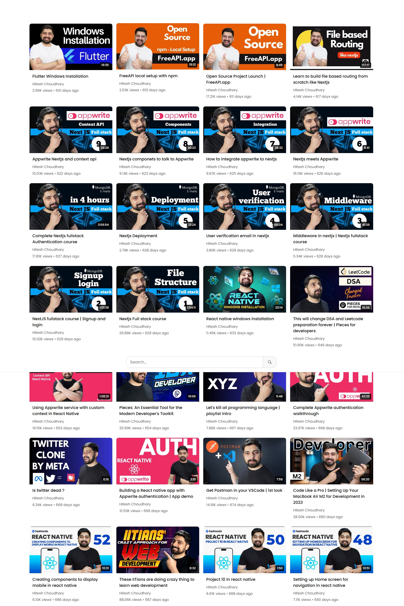
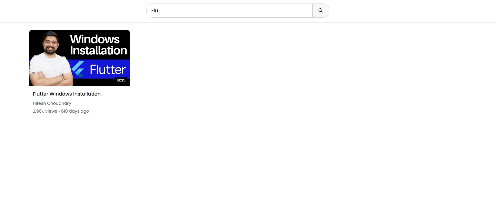

# YouTube Video Listing

This project allows users to browse and manage a collection of YouTube videos. It provides features for viewing video details, including titles, descriptions, and thumbnails.

## Table of Contents

- [YouTube Video Listing](#youtube-video-listing)
  - [Table of Contents](#table-of-contents)
  - [Deployment](#deployment)
  - [Features](#features)
  - [Technologies Used](#technologies-used)
  - [Installation](#installation)
  - [Preview](#preview)
  - [Acknowledgement](#acknowledgement)

## Deployment

- **Live link**: https://youtube-video-listing-wheat.vercel.app/

## Features

- **Responsive Design**: The project adjusts its layout based on the screen size using grid and media queries, ensuring a great user experience on both desktop and mobile devices.
- **Video Thumbnails**: Displays engaging thumbnails for each video, making it easy for users to identify content.
- **Search Functionality**: Users can search for specific videos by title or keyword.
- **Video Details**: Each video card includes a title, description, and a link to view the video on YouTube.
- **User-Friendly Interface**: A clean and modern UI that enhances navigation and interaction.

## Technologies Used

- **HTML5**: For the structure of the project.
- **CSS3**: For styling and responsive design.
- **JavaScript**: For interactive elements.
- **Free API Data API**: Used to fetch video details and manage video listings.

## Installation

1. Clone the repository:
   ```bash
   git clone https://github.com/Depkstha/video.git
   ```

2. Navigate into the project directory:
   ```bash
   cd video
   ```

3. Open `index.html` in your web browser to view the project.

## Preview
This is what it looks like



## Acknowledgement
This project is part of an assignment provided by Cohort on Masterji. A special thanks to Hitesh Sir, Piyush Sir, TAs, and the entire team for running such a wonderful cohort successfully. I am honored to be a part of it. Love and support from Nepal!
